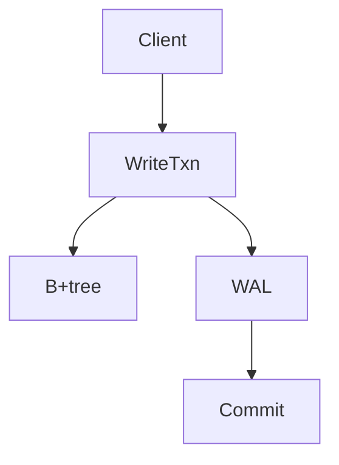

# NorthstarDB Documentation

[](https://github.com/northstardb/plandb/actions/workflows/docs.yml)
[](https://starlight.astro.build)

This is the official documentation for NorthstarDB, built with [Astro](https://astro.build) and [Starlight](https://starlight.astro.build).

## 📚 Documentation Structure

```
docs/
├── src/
│   ├── content/
│   │   └── docs/
│   │       ├── index.mdx           # Landing page
│   │       ├── concepts/           # Core concepts
│   │       ├── guides/             # How-to guides
│   │       ├── reference/          # API reference
│   │       ├── architecture/       # Architecture docs
│   │       ├── ai/                 # AI features
│   │       └── specs/              # Specifications
│   └── assets/                     # Images, diagrams
├── adr/                            # Architecture Decision Records
├── public/                         # Static assets
├── astro.config.mjs                # Astro configuration
└── package.json                    # Dependencies
```

## 🚀 Local Development

### Prerequisites

- Node.js 20 or later
- npm (comes with Node.js)

### Setup

```bash
cd docs
npm install
```

### Run Development Server

```bash
npm run dev
```

Open `http://localhost:4321` in your browser.

### Build Documentation

```bash
npm run build
```

The built documentation will be in the `dist/` directory.

### Preview Production Build

```bash
npm run build
npm run preview
```

## 🌐 Deployment

### GitHub Pages

Documentation is automatically deployed to GitHub Pages when changes are pushed to the `main` branch:

- **Production**: https://northstardb.github.io/plandb/
- **Build Trigger**: Push to `main` branch
- **Preview**: Download artifact from Actions tab for PRs

### Manual Deployment

To manually deploy the documentation:

```bash
cd docs
npm run build
# Deploy dist/ folder to your hosting provider
```

## 📝 Adding Documentation

### Creating New Pages

1. Create a new `.mdx` file in `src/content/docs/`
2. Add frontmatter with title and description:

```mdx
---
title: Your Page Title
description: A brief description of the page content
---

# Your Content

Write your documentation here using Markdown.
```

### Code Examples

Use fenced code blocks with language identifiers:

``````mdx
```zig
const db = try Db.open(allocator);
defer db.close();

var w = try db.beginWrite();
try w.put("key", "value");
_ = try w.commit();
```
``````

### Diagrams

For simple diagrams, use ASCII art or Mermaid:



## 🔧 Configuration

### Site Configuration (`astro.config.mjs`)

Edit `astro.config.mjs` to change:
- Site title and logo
- Navigation menu
- Sidebar structure
- Theme colors

### Content Configuration (`src/content.config.ts`)

Define collections and schema for content validation.

## 📖 Resources

- [Astro Documentation](https://docs.astro.build)
- [Starlight Documentation](https://starlight.astro.build)
- [MDX Specification](https://mdxjs.com/)

## 🤝 Contributing

When contributing documentation changes:

1. **Test locally**: Run `npm run dev` and preview your changes
2. **Build check**: Run `npm run build` to ensure no build errors
3. **Link check**: Verify all internal and external links work
4. **Spelling**: Use correct spelling and consistent terminology

See [Contributing Guide](https://northstardb.github.io/plandb/contributing) for more details.
