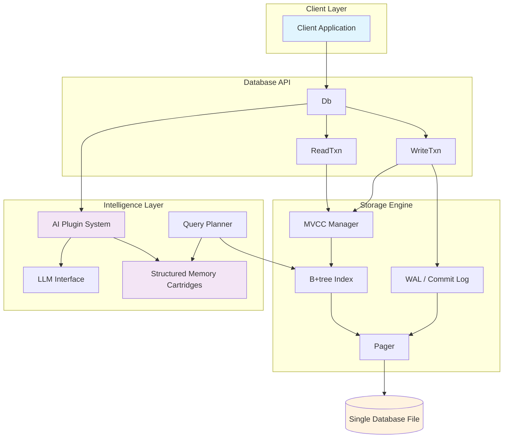
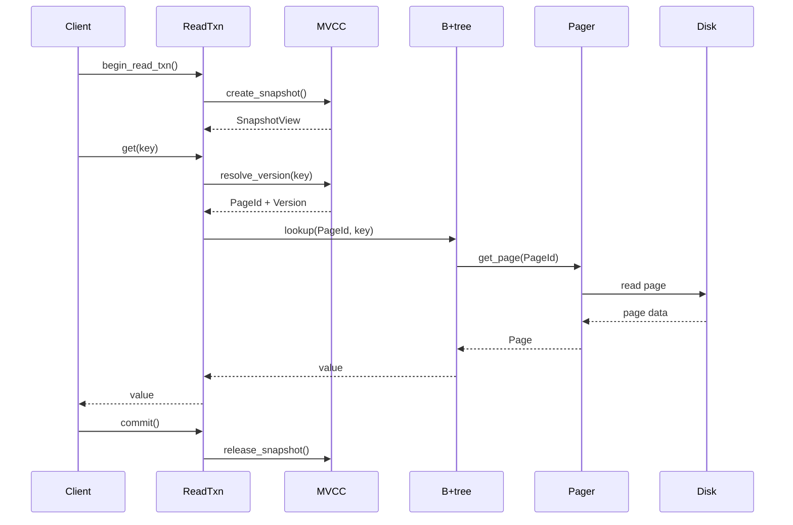
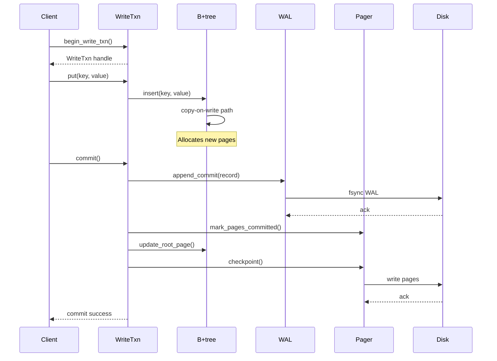
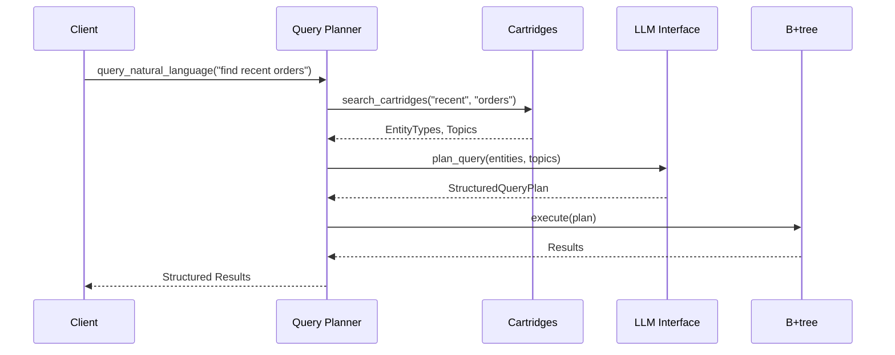

# Architecture Overview

NorthstarDB is a single-file embedded database designed for massive read concurrency and deterministic replay, with an AI-powered intelligence layer for autonomous data understanding and optimization.

## System Architecture

## Core Components

### Storage Engine

- **Pager**: Page allocation, caching, and physical I/O to the single database file
- **B+tree**: Ordered key-value store with copy-on-write semantics
- **MVCC**: Snapshot isolation for concurrent readers without blocking
- **WAL/Commit Log**: Append-only log for crash recovery and time-travel queries

### Intelligence Layer (Phase 7)

- **AI Plugin System**: Hook-based architecture for AI operations
- **LLM Interface**: Provider-agnostic API for OpenAI, Anthropic, local models
- **Structured Memory Cartridges**: Entity-topic-relationship knowledge graphs
- **Query Planner**: Natural language to structured query translation

## Data Flow

### Read Path

**Key characteristics**:
- Readers never block writers or each other
- Snapshots provide consistent view at point in time
- Zero coordination cost for reads

### Write Path

**Key characteristics**:
- Single writer at a time (simplified isolation)
- Crash-safe via write-ahead log
- Copy-on-write provides rollback safety

### AI Query Flow

**Key characteristics**:
- Deterministic function calling, not embeddings
- Provider-agnostic LLM interface
- Graceful degradation if AI unavailable
- Queries combine semantic + structured search

## Component Interactions

### MVCC + B+tree

- B+tree maintains version chains for each key
- MVCC snapshots resolve which version a reader sees
- Writers create new versions without blocking readers
- Old versions reclaimed after snapshot expiration

### Cartridges + B+tree

- Cartridges store entity/topic metadata
- B+tree stores raw data with cartridge references
- AI queries join cartridge graph + B+tree lookups
- Cartridge updates trigger B+tree metadata writes

### WAL + Pager

- WAL stores all commit records sequentially
- Pager reads WAL during recovery
- Checkpoints merge WAL changes into main file
- Time-travel queries replay WAL from specific LSN

## Technology Choices

### Why Zig?

| Aspect | Rationale |
|--------|-----------|
| **Explicit Memory** | Database requires precise control over allocation, layout, and lifecycle |
| **Explicit Errors** | Crash safety means every error path must be handled |
| **No Hidden Allocation** | Predictable performance, no surprise GC pauses |
| **C Interop** | Easy FFI for testing, benchmarking, future C API |
| **Compile-time Computation** | Optimize serializers, checksums, validation at build time |

### Why Copy-on-Write B+tree?

| Aspect | Rationale |
|--------|-----------|
| **Ordered Keys** | Range scans are critical for analytics and time-travel |
| **Copy-on-Write** | Natural support for snapshots and versioning |
| **Predictable Depth** | O(log n) with bounded fanout, performance predictable |
| **Page-aligned** | Maps perfectly to pager system |
| **Tested Design** | Decades of production use in databases (LMDB, BoltDB) |

### Why MVCC Snapshot Isolation?

| Aspect | Rationale |
|--------|-----------|
| **Zero Read Locks** | Many readers, no coordination cost |
| **Consistent Views** | Each transaction sees point-in-time snapshot |
| **Simple Conflict Detection** | Write-write conflicts detected at commit |
| **Natural for Time-Travel** | Snapshots are first-class, can be restored |
| **Proven Pattern** | Used by PostgreSQL, SQLite (WAL mode) |

### Why Commit Stream Format?

| Aspect | Rationale |
|--------|-----------|
| **Append-Only** | Sequential writes, fastest possible storage |
| **Immutable Log** | Natural support for replay and replication |
| **Deterministic** | Same log produces same database state |
| **Queryable** | Can scan log for analytics without materializing |
| **Crash Recovery** | Replay log from last checkpoint |

### Why Cartridge-Based Intelligence?

| Aspect | Rationale |
|--------|-----------|
| **Structured Memory** | Entities/topics/relationships, not black-box embeddings |
| **Deterministic** | Function calling produces reproducible results |
| **Queryable** | Can reason about memory structure with SQL-like queries |
| **Self-Contained** | Cartridges travel with database file |
| **Extensible** | New cartridge types without core changes |

## Performance Characteristics

| Operation | Complexity | Notes |
|-----------|------------|-------|
| Point Get | O(log n) | B+tree lookup via snapshot |
| Point Put | O(log n) | Copy-on-write path |
| Range Scan | O(log n + k) | k = items scanned |
| Snapshot Create | O(1) | Capture current LSN |
| Time Travel | O(k) | k = commits to replay |
| AI Entity Query | O(log n + m) | m = matches in cartridges |

## Security and Hardening

- **Memory Safety**: Zig's compile-time bounds checking
- **Crash Safety**: Write-ahead log with fsync guarantees
- **Fuzz Testing**: Property-based hardening tests (see `spec/hardening_v0.md`)
- **Checksums**: Per-page validation during reads
- **Input Validation**: All keys/values validated before acceptance

## Future Evolution

The architecture is designed to evolve through phases:

- **Phase 0-3**: Core database functionality (current)
- **Phase 4**: Documentation and guides
- **Phase 5**: Architecture and ADRs
- **Phase 6**: Production hardening and observability
- **Phase 7**: AI intelligence layer (detailed in `PLAN-LIVING-DB.md`)

Each phase adds capability without breaking existing guarantees.
